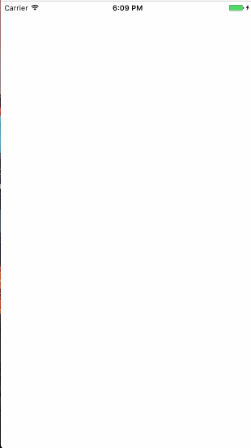

# MGCircleView
### 圆环指示器效果图

<p align="center">


</p>


**核心步骤讲解**

> 该控件有2部分组成，一个是底部的圆环（MGCircleAnimationView类），另一部指示器（MGIndicatorView）构成

* 绘制底层的虚线圆

```
/**
 ** lineView:       需要绘制成虚线的view
 ** lineWidth:     虚线的宽度
 ** lineSpacing:    虚线的间距
 ** lineColor:      虚线的颜色
 **/
- (void)drawDashLine:(UIView *)lineView
           lineWidth:(int)lineWidth
         lineSpacing:(int)lineSpacing
           lineColor:(UIColor *)lineColor
                path:(UIBezierPath *)path
{
    CAShapeLayer *shapeLayer = [CAShapeLayer layer];
    
    self.bottomLayer = shapeLayer;
    
    [shapeLayer setBounds:lineView.bounds];
    
    [shapeLayer setPosition:CGPointMake(self.width / 2, self.height / 2)];
    
    [shapeLayer setFillColor:[UIColor clearColor].CGColor];
    
    //  设置虚线颜色为blackColor
    [shapeLayer setStrokeColor:lineColor.CGColor];
    
    //  设置虚线长度
    [shapeLayer setLineWidth:8];
    
    [shapeLayer setLineJoin:kCALineJoinRound];
    
    //  设置线宽，线间距
    [shapeLayer setLineDashPattern:[NSArray arrayWithObjects:[NSNumber numberWithInt:lineWidth],
                                    [NSNumber numberWithInt:lineSpacing], nil]];

    shapeLayer.strokeColor = lineColor.CGColor;
    
    shapeLayer.path = path.CGPath;
    
    //  把绘制好的虚线添加上来
    [self.layer addSublayer:shapeLayer];
}
```

* 绘制进度

```
/**
 ** lineView:       需要绘制成虚线的view
 ** lineWidth:     虚线的宽度
 ** lineSpacing:    虚线的间距
 ** lineColor:      虚线的颜色
 **/
- (void)drawDashProgressLine:(UIView *)lineView
                   lineWidth:(int)lineWidth
                 lineSpacing:(int)lineSpacing
                   lineColor:(UIColor *)lineColor
                        path:(UIBezierPath *)path
{
    CAShapeLayer *shapeLayer = [CAShapeLayer layer];
    
    self.progressLayer = shapeLayer;
    
    [shapeLayer setBounds:lineView.bounds];
    
    [shapeLayer setPosition:CGPointMake(self.width / 2, self.height / 2)];
    
    [shapeLayer setFillColor:[UIColor clearColor].CGColor];
    
    //  设置虚线颜色为blackColor
    [shapeLayer setStrokeColor:lineColor.CGColor];
    
    //  设置虚线长度
    [shapeLayer setLineWidth:8];
    
    [shapeLayer setLineJoin:kCALineJoinRound];
    
    //  设置线宽，线间距
    [shapeLayer setLineDashPattern:[NSArray arrayWithObjects:[NSNumber numberWithInt:lineWidth],
                                    [NSNumber numberWithInt:lineSpacing], nil]];
    
    shapeLayer.strokeColor = lineColor.CGColor;
    
    shapeLayer.path = path.CGPath;
    
    shapeLayer.strokeEnd = 0;
    
    [self.layer addSublayer:self.progressLayer];
    
}
```


### 添加指示器，设置弧度动画

* 添加指示器

```
MGIndicatorView 为指示器类

// 弧形动画
- (void)circleAnimation
{
    [CATransaction begin];
    
    /** 对layer层的属性操作，都会形成隐式动画，要使用隐式动画，需要关闭layer层的animation动画属性 */
    [CATransaction setDisableActions:NO]; // 关闭animation动画效果，开启隐式动画
    
    [CATransaction setAnimationTimingFunction:[CAMediaTimingFunction functionWithName:kCAMediaTimingFunctionLinear]];
    
    [CATransaction setAnimationDuration:kAnimationTime];
    
    self.progressLayer.strokeEnd = _percent / self.ideallyValue;
    
    [CATransaction commit];
    
}

```


